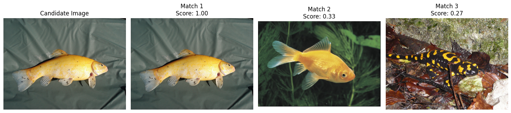

# Image Similarity Detection

This project provides tools for computing and comparing image similarities using deep learning features extracted by a pretrained VGG16 model. It includes functionality to preprocess images, compute image embeddings, store and load embeddings, and visualize similarities between a candidate image and a database of images.

## Features

- **Preprocessing**: Convert images to a standardized format suitable for feature extraction.
- **Feature Extraction**: Use a pretrained VGG16 model to extract deep features from images.
- **Embedding Storage**: Save and load image embeddings using HDF5 format for efficient storage and retrieval.
- **Similarity Comparison**: Compute cosine similarities between the feature vectors of images.
- **Visualization**: Display the candidate image alongside its most similar images from the database.

## Prerequisites

Before you begin, ensure you have met the following requirements:

- Python 3.8 or higher
- PyTorch, torchvision (for neural network operations)
- scikit-learn (for cosine similarity calculation)
- h5py (for handling HDF5 files)
- matplotlib, Pillow (for image loading and visualization)

You can install all required packages with the following command:

```bash
pip install torch torchvision scikit-learn h5py matplotlib pillow
```

or run the below command

```
conda env create -f environment.yml
```

## Usage

To use this project, follow these steps:

1. **Set up your image directories**: Place your database images in `./final_search_img_dir` and your candidate image in `./candidate_img_dir`.

2. **Run the feature extraction**:
   - This will process all images in the specified directory, compute their features, and save these embeddings to an HDF5 file.

3. **Load and compare**:
   - The embeddings will be loaded, and the similarity of a new candidate image to the images in the database will be calculated.

4. **Visualize**:
   - Use the provided visualization function to see the candidate image and its top matches from the database.

Run the script from the command line:

```bash
python image_similarity.py
```
Or Run the cell of code from Jupyter Notebook.




## Contact

If you want to contact me you can reach me at shafi.cse.brur@gmail.com .
